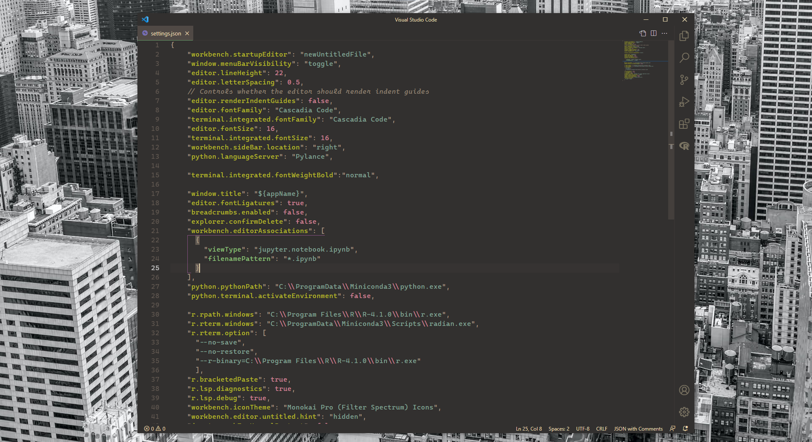
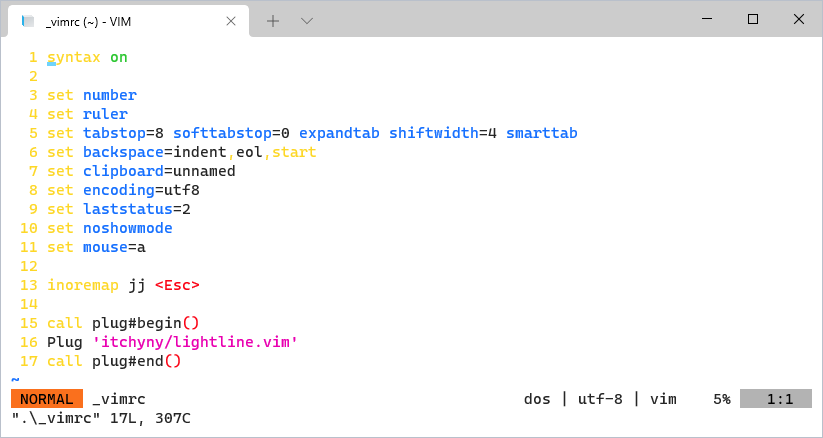

# Mis configuraciones ⚙️
Soy una persona que suele instalar diversos programas debido a cursos de la carrera, conque de vez en cuando necesito darme un respiro e iniciar en un entorno fresco. Es entonces cuando estos pequeños archivos hacen la magia para mí 🔮.

## Windows Terminal

Instalaciones requeridas:

* [PowerShell](https://github.com/PowerShell/powershell/releases)
* [Oh My Posh](https://ohmyposh.dev/docs/)
* [Chocolatey](https://chocolatey.org/install)
  * [Posh-Git](https://github.com/dahlbyk/posh-git)
  * [Vim-Console Only](https://community.chocolatey.org/packages/vim-console)

## Visual Studio Code

Actualmente el estilo se basa principalmente en:

* [Gruvbox Theme](https://marketplace.visualstudio.com/items?itemName=jdinhlife.gruvbox)

* [Bracket Pair Colorizer 2](https://marketplace.visualstudio.com/items?itemName=CoenraadS.bracket-pair-colorizer-2)

* [Cascadia Code](https://github.com/microsoft/cascadia-code)

### Python

Me motivé a dejar Spyder y pasarme a Miniconda + VS Code luego de leer la guía de [maurosilber](http://users.df.uba.ar/maurosilber/python/).

* [Miniconda/Python 3.9 ](https://docs.conda.io/en/latest/miniconda.html)
* [Python for VS Code](https://marketplace.visualstudio.com/items?itemName=ms-python.python)
* [Python Indent](https://marketplace.visualstudio.com/items?itemName=KevinRose.vsc-python-indent)

### R

Me inicié con R en VS Code luego de leer la guía de [Varun Guttikonda]([A fresh start for R in VSCode. Setting up Visual Studio Code for R… | by Varun Guttikonda | Analytics Vidhya | Medium](https://medium.com/analytics-vidhya/a-fresh-start-for-r-in-vscode-ec61ed108cf6)).

* [R 4.1](https://cran.r-project.org/bin/windows/base/)
* [R for VS Code](https://marketplace.visualstudio.com/items?itemName=Ikuyadeu.r)
* [R LSP Client](https://marketplace.visualstudio.com/items?itemName=REditorSupport.r-lsp)
* [Radian](https://anaconda.org/conda-forge/radian)

## Vim-Console

Solo lo uso para revisar rápidamente algún archivo en la terminal, mi editor principal es VS Code. Por ello, el único paquete que siento abarca mis necesidades es el [Lightline](https://github.com/itchyny/lightline.vim).

