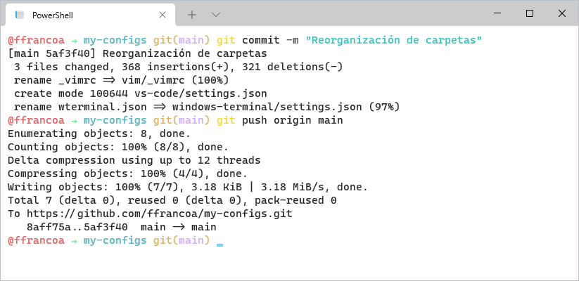

# Mis configuraciones ⚙️
Soy una persona que suele instalar diversos programas debido a cursos de la carrera, conque de vez en cuando necesito darme un respiro e iniciar en un entorno fresco. Es entonces cuando estos pequeños archivos hacen la magia para mí 🔮.

## Windows Terminal

Instalaciones requeridas:

* [Powershell 7]([Releases · PowerShell/PowerShell (github.com)](https://github.com/PowerShell/powershell/releases))
* [Oh My Posh]([Introduction | Oh My Posh](https://ohmyposh.dev/docs/))
* [Chocolatey]([Chocolatey Software | Installing Chocolatey](https://chocolatey.org/install))
  * [Posh-Git]([dahlbyk/posh-git: A PowerShell environment for Git (github.com)](https://github.com/dahlbyk/posh-git))
  * [Vim-Console Only]([Chocolatey Software | Vi iMproved (Vim) - console only 8.2](https://community.chocolatey.org/packages/vim-console))

## Visual Studio Code

Actualmente el estilo se basa principalmente en:

* [Gruvbox Theme]() (Aunque cambio bastante a menudo)

* [Bracket Pair Colorizer 2]([Bracket Pair Colorizer 2 - Visual Studio Marketplace](https://marketplace.visualstudio.com/items?itemName=CoenraadS.bracket-pair-colorizer-2))

* [Cascadia Code]([microsoft/cascadia-code: This is a fun, new monospaced font that includes programming ligatures and is designed to enhance the modern look and feel of the Windows Terminal. (github.com)](https://github.com/microsoft/cascadia-code))

### Python

Me motivé a dejar Spyder y pasarme a Miniconda + VS Code luego de leer la guía de [maurosilber]([users.df.uba.ar/maurosilber/python/](http://users.df.uba.ar/maurosilber/python/)).

* [Miniconda/Python 3.9 ]([Miniconda — Conda documentation](https://docs.conda.io/en/latest/miniconda.html))
* [Python for VS Code]([Python - Visual Studio Marketplace](https://marketplace.visualstudio.com/items?itemName=ms-python.python))
* [Python Indent]([Python Indent - Visual Studio Marketplace](https://marketplace.visualstudio.com/items?itemName=KevinRose.vsc-python-indent))

### R

Me inicié con R en VS Code luego de leer la guía de [Varun Guttikonda]([A fresh start for R in VSCode. Setting up Visual Studio Code for R… | by Varun Guttikonda | Analytics Vidhya | Medium](https://medium.com/analytics-vidhya/a-fresh-start-for-r-in-vscode-ec61ed108cf6)).

* [R 4.1]([Download R-4.1.0 for Windows. The R-project for statistical computing.](https://cran.r-project.org/bin/windows/base/))
* [R for VS Code]([R - Visual Studio Marketplace](https://marketplace.visualstudio.com/items?itemName=Ikuyadeu.r))
* [R LSP Client]([R LSP Client - Visual Studio Marketplace](https://marketplace.visualstudio.com/items?itemName=REditorSupport.r-lsp))
* [Radian]([Radian :: Anaconda.org](https://anaconda.org/conda-forge/radian))

## Vim-Console

Solo lo uso para revisar rápidamente algún archivo en la terminal, mi editor principal es VS Code. Por ello, el único paquete que siento abarca mis necesidades es el [Lightline]([itchyny/lightline.vim: A light and configurable statusline/tabline plugin for Vim (github.com)](https://github.com/itchyny/lightline.vim)).

